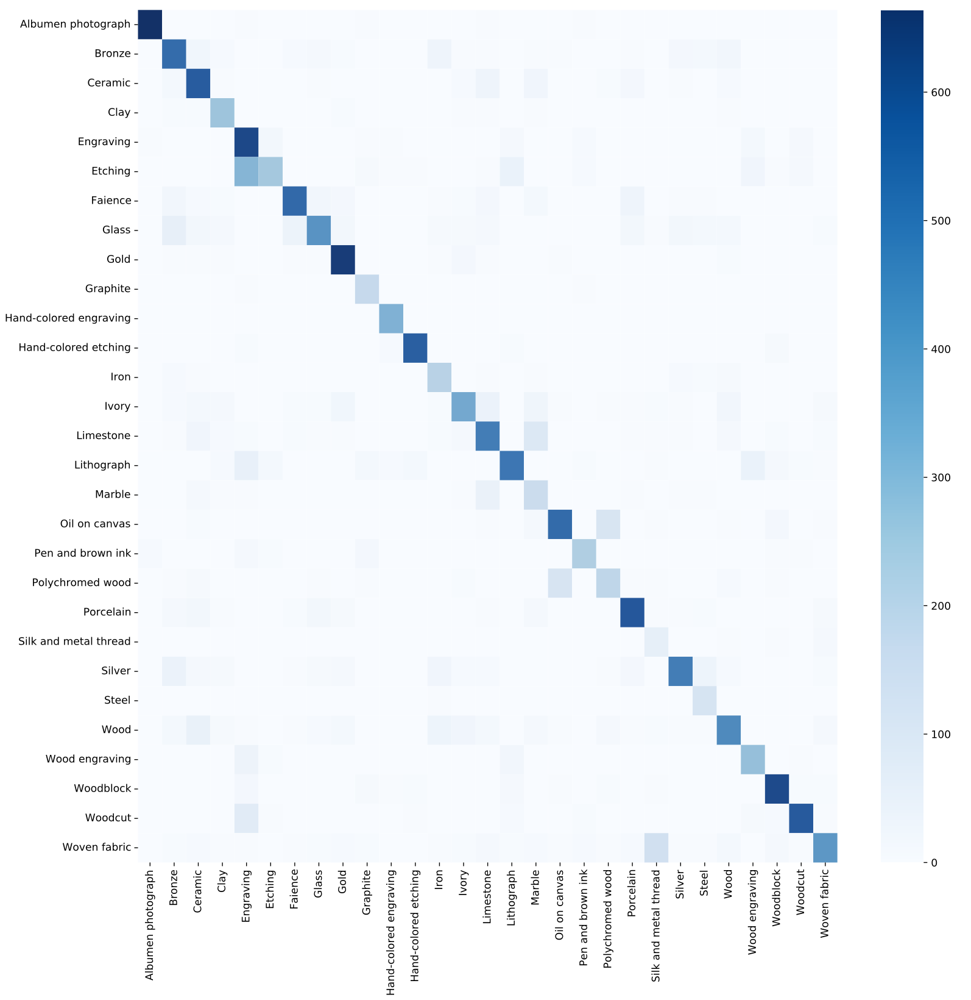
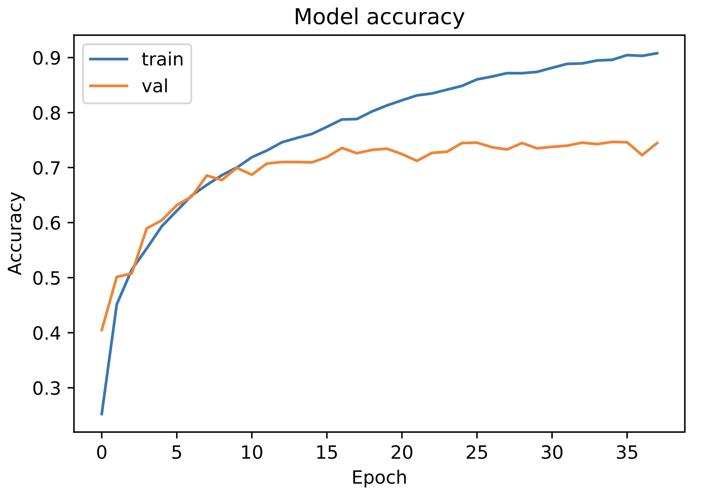
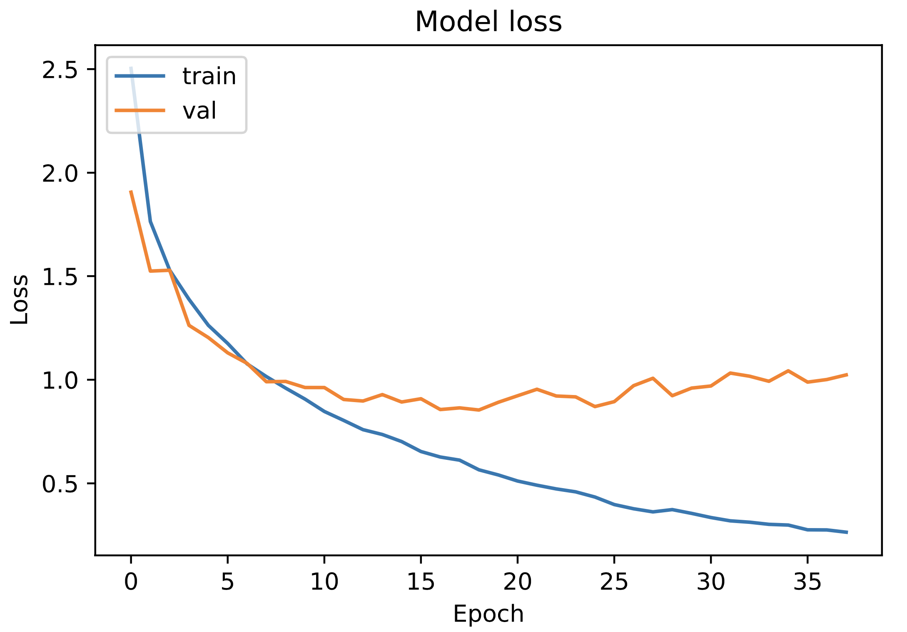

# MAMe dataset 🎨🤖
Museum Art Mediums image classification task solved by [Laia Borrell Araunabeña ](https://github.com/Laiaborrell) and [Mario Lozano Cortés](https://github.com/SrLozano), Artificial Intelligence master's students at _Universitat Politècnica de Catalunya · BarcelonaTech - UPC_. The resolution of this task is part of the Deep Learning subject.

## Goal of the project 💥💯
Get the highest possible accuracy on the test set.

## The dataset 🗂🖼
The MAMe dataset is a novel image classification task focused on museum art mediums. Data is gathered from three different museums:

- The Metropolitan Museum of Art of New York.
- The Los Angeles County Museum of Art.
- The Cleveland Museum of Art.

Data from all museums is aggregated by art experts into 29 classes of mediums (i.e., materials and techniques).

The MAMe dataset is originally introduced in the paper [The MAMe Dataset: On the relevance of High Resolution and Variable Shape image properties](https://arxiv.org/abs/2007.13693). Although here in this project only 256x256 images version of the dataset is considered, the original MAMe dataset with high-resolution images of variable shape can be download from its oficial [website](https://storage.hpai.bsc.es/mame-dataset/MAMe_data.zip). Additionally, a set of baseline models and code used to train them is available in the oficial github [repository](https://github.com/HPAI-BSC/MAMe-baselines).

Data is expected at the dataset folder. In this folder two other folders are expected:

- data_256: All the images that are going to be used in the task. The _sort_dataset_folder_ is in charged of the sorting of this folder by considering the definitions stated in the metadata folder. The images can be found in the following [link](https://storage.hpai.bsc.es/mame-dataset/MAMe_data_256.zip)
- MAMe_metada: Labels and information of each on of the images. A copy of this folder can be found in the docs folder.

## Architecture proposed 🏛

- Learning rate = 0.001
- Optimizer = Adam
- Batch size = 128

```python
model = tf.keras.models.Sequential()

model.add(tf.keras.layers.Conv2D(32, (3, 3), activation='relu', padding='same', kernel_initializer="he_normal", input_shape=(256, 256, 3)))
model.add(tf.keras.layers.Conv2D(64, (3, 3), activation='relu', padding='same'))
model.add(tf.keras.layers.Conv2D(128, (3, 3), activation='relu', padding='same'))
model.add(tf.keras.layers.Conv2D(256, (3, 3), activation='relu', padding='same'))

model.add(GlobalMaxPooling2D())
model.add(tf.keras.layers.Dropout(0.3))
model.add(tf.keras.layers.Dense(1024, activation='relu'))
model.add(tf.keras.layers.Dense(512, activation='relu'))
model.add(tf.keras.layers.Dense(29, activation='softmax'))
```

## Run it 🚀

Run mame_cnn.py in order to train the selected model (specified in the exp variable) or run ready_to_go_model.py to load and use an already trained model.

## Results 📊








## Next updates 🔜
Overfitting limitation

## Issues 🤕
Overfitting

## Want to collaborate? 🙋🏻
Feel free to improve and optimize the existing code. To contribute to the project, read the previous points carefully and do the next steps with the project:
1. Fork it (<https://github.com/SrLozano/MAMe_DL>)
2. Create your feature branch (`git checkout -b feature/MAMe`)
3. Commit your changes (`git commit -am 'Increased accuracy to ...'`)
4. Push to the branch (`git push origin feature/MAMe`)
5. Create a new Pull Request

## Need help ❓
Feel free to contact the developer if you have any questions or suggestions about the project or how you can help with it.